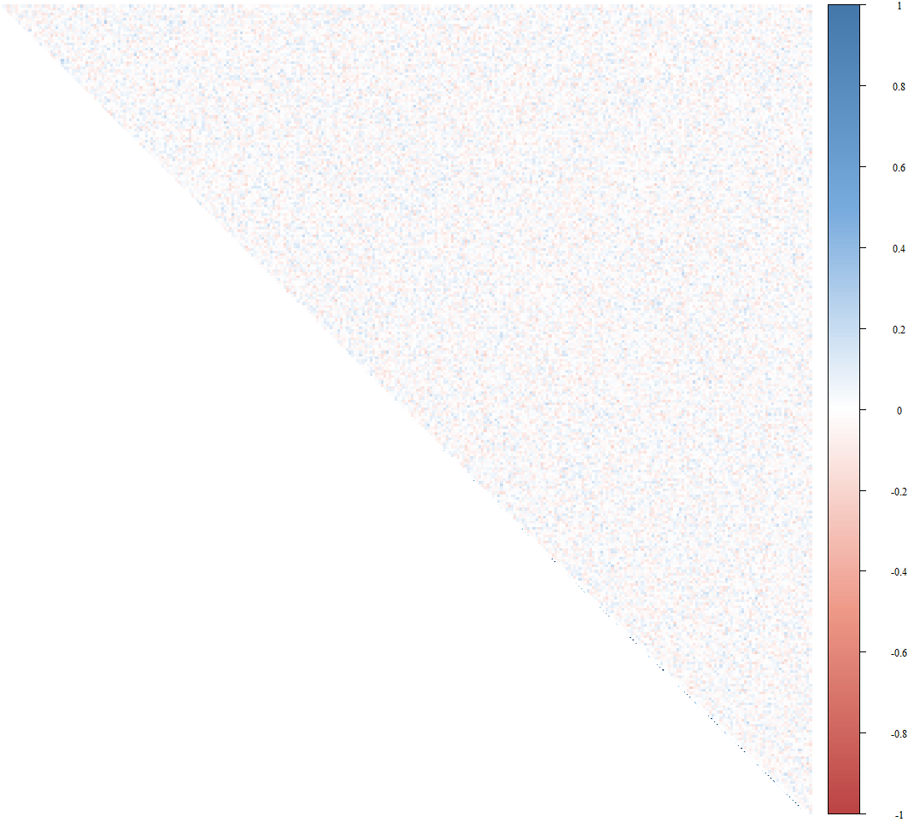
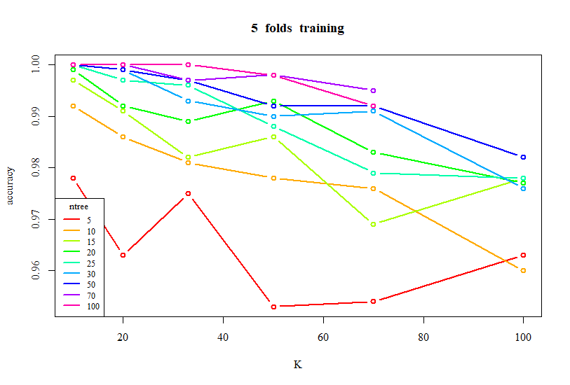
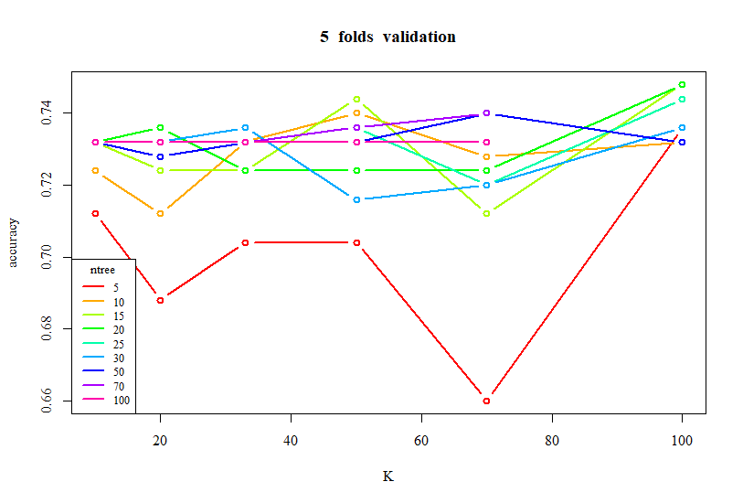
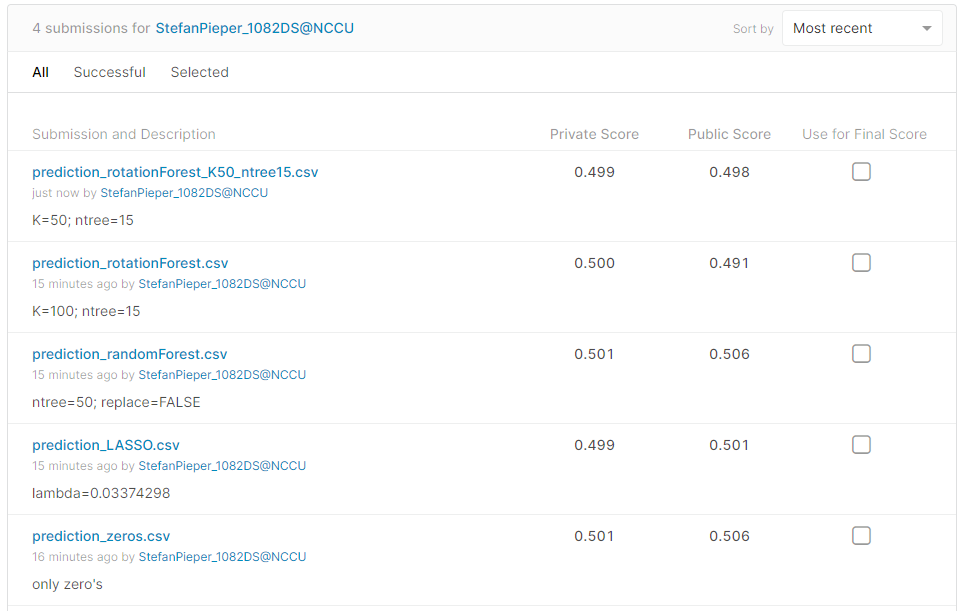

# Don't Overfit

### Groups
* Stefan Pieper, 108300154

### Goal
During the course I have been intrested in data sets with a large amount of features, and how to model these data sets. There are many methods one can use to try to reduce the dimension of the model (PCA) or to perform a feature selection (LASSO, random forest). However, I was interested in trying to combine two of these models in order to get the best results.
Therefore, I use and ensemble method based on PCA and random forest to see if it performs better than other more conventional methods. 

### Demo 


Demo run (uses cross validation results of a previous run)
```R
Rscript code/code.R --runtype demo --fold 5 --train data/train.csv --test data/test.csv --report results/report.csv --predict results/predict.csv
```

Short run (models only use a few combinations of parameters to decrease running time)
```R
Rscript code/code.R --runtype short --fold 5 --train data/train.csv --test data/test.csv --report results/report.csv --predict results/predict.csv
```

Long run (takes up to a 100 for ntree; takes a day to run)

```R
Rscript code/code.R --runtype long --fold 5 --train data/train.csv --test data/test.csv --report results/report.csv --predict results/predict.csv
``` 


## Folder organization and its related information

### docs
* [Powerpoint Presentation](docs/1072_datascience_FP_StefanPieper.pptx)
* [Original Paper on Rotation Forest](docs/Rotation_Forest_Paper_(2006).pdf)
* [Software User Guide](docs/Software_Guide.md)

### data

* Kaggle (Don't overfit competition)
* https://www.kaggle.com/c/dont-overfit-ii
* .csv
* Little correlation:




### code

* Rotation Forest (Alonso, Rodríguez & Kuncheva, 2006)
* Since most of the response of the training set is zeros, the null model is a vector of zeros. Additionally, the conventional feature selections methods LASSO and random forest are used as a comparison.
* 5-fold cross validation is performed by splitting the training set of 250 observations in five parts. The test has 19750 observations only kaggle has the target variable.

### results

* Accuracy is used to compare models
* The improvement does not seem significant
* Finding data was by far the hardest part of the assignment. The model process itself was quite challenging, and the model itself took over a day to run. Sadly, the results were not great, possible due to the lack of correlation between variables.
* Below are two graphs of the accuracies of the rotation models on the training and validation set respectively. Below that is a screenshot of the kaggle result, where the accuracy of the models seems low.






## References
* Alonso, C.J., Rodríguez, J.J., Kuncheva, L.I. (2006). Rotation Forest: A New Classifier Ensemble Method. 
IEEE Transactions on Pattern Analysis and Machine Intelligence, 28(10), 1619-1630

## Packages
* corrplot
* glmnet
* randomForest
* rotationForest (My rotation forest functions are heavily based on the rotationForest function in this package)
* rpart

